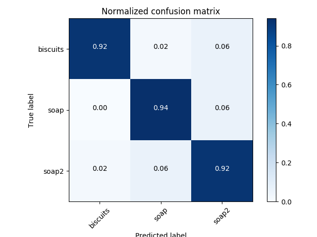
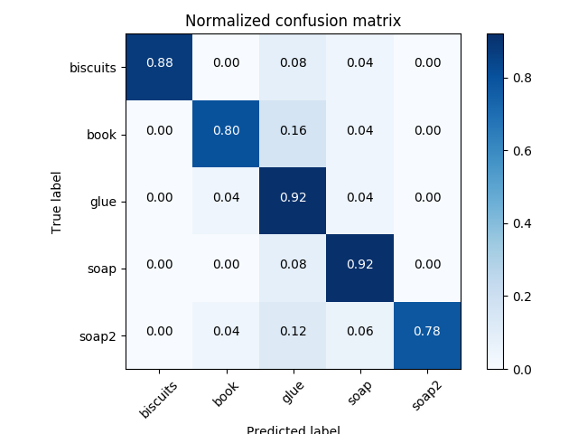
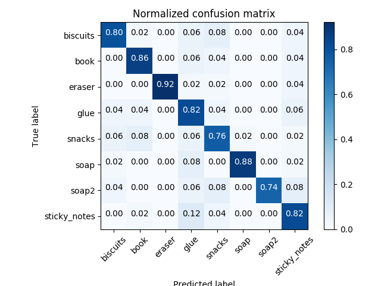
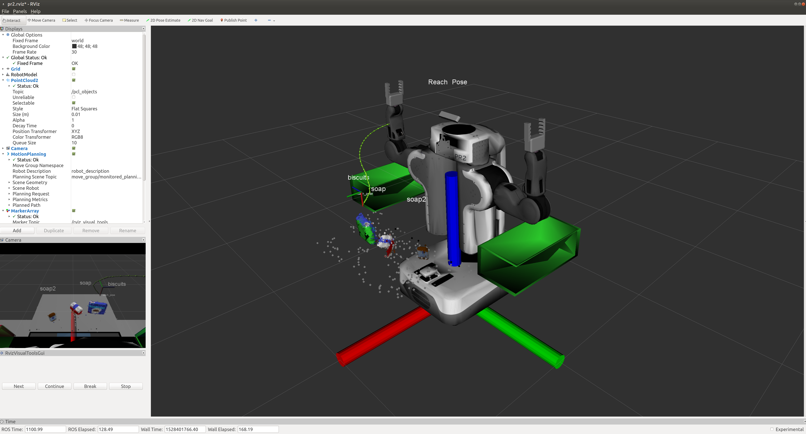
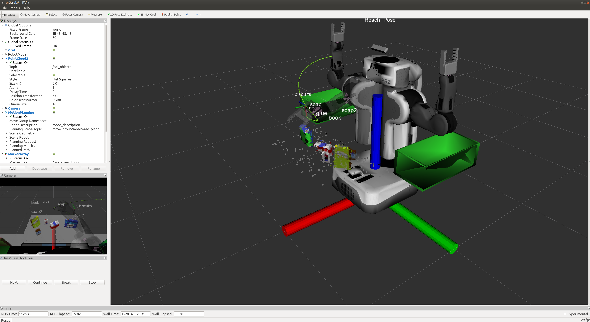
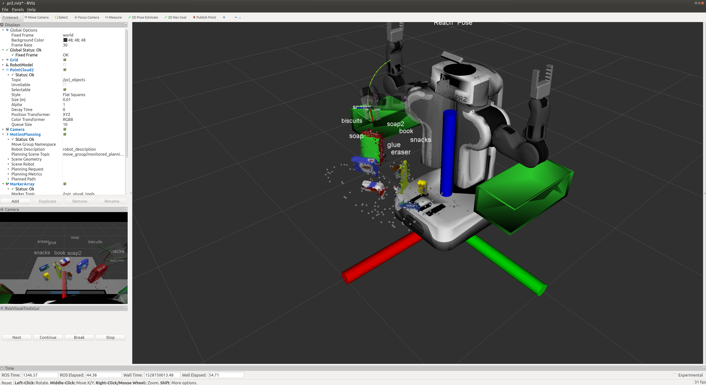

# Project: Perception Pick & Place

## I. Capture Features
To capture features and train the SVM model, the system needs to be launched into an empty world. Hence the previously used launch file `REPO_ROOT/pr2_robot/launch/training.launch` is reused. Before capturing features, first run:
```bash
# From REPO_ROOT
roslaunch pr2_robot training.launch
``` 

The feature extraction code from previous exercises is also reused in this project, which can be found at `REPO_ROOT/pr2_robot/scripts/capture_features.py`. To launch different pick up list and save the training data under different names, this new code now takes one argument - number `1`, `2` or `3`. To capture features, open a new terminal and run:
```bash
# From REPO_ROOT
./pr2_robot/scripts/capture_features.py PICK_UP_LIST_NUM
```

For example, if `PICK_UP_LIST_NUM = 1`, then `pick_up_list_1` will be pulled and a training data file `training_set_1.sav` will be generated in `REPO_ROOT` folder.

## II. Training
The SVM training code is reused in this project with some modification to adapt to different scenarios. It also takes one argument - number `1`, `2` or `3` in order to load different training data for different scenarios. It assumes training data is stored at `REPO_ROOT` folder. To train a SVM model, keep the `training.launch` terminal open, open a new terminal and run:
```bash
# From REPO_ROOT
./pr2_robot/scripts/train_svm.py PICK_UP_LIST_NUM
```

For example, if `PICK_UP_LIST_NUM = 2`, then `training_set_2.sav` will be trained and a new model file `model_2.sav` will be generated in `REPO_ROOT` folder.

In this project, a total of 50 samples for each object were collected for training. The confusion matrcies of trained SVM models are shown below:

Test world 1 (pickup list 1)



Test world 2 (pickup list 2)



Test world 3 (pickup list 3)



The normalized confusion matrices suggest that the trained SVM models should work fine in object recognition down in the pipeline.

## III. Perception Pipeline
To run the perception pipeline, first define the scenario and pick up list in `pick_place_project.launch` and then run:
```bash
roslaunch pr2_robot pick_place_project.launch
```

Then, open a new terminal and run the perception pipeline code:
```bash
./pr2_robot/scripts/perception_pipeline.py
```

The perception pipeline code doesn't take any argument and can automatically pull the matching trained model based on the choice of pick up list defined in `pick_place_project.launch` file.

### 1. Filtering, Clustering and Classification
The pipeline completed in Exercise 1-3 is reused in `perception_pipeline.py` as in lines `56-251`, including filtering (lines `59-148`), clustering (lines `150-203`) and classification (lines `207-245`).

In addition to the passthrough filter applied at `z` axis, I also added another one at `y` axis to ensure the edges of the dropboxes on both sides are not misidentified as objects due to the wider view of the camera. The corresponding code can be found at lines `96-107`.

### 2. Pick and Place
This portion can be found at lines `266-356` in `perception_pipeline.py`. 

It iterates over the detected objects and then decide which arm should be used to pick it up based on the `group` definition in pick up list file. Object centroid is then calculated by average `x`, `y` and `z` values of the object cloud and converted to ROS Pose data type. In addition, target place location is determined by dropbox location defined in `dropbox.yaml`. Data also needs to be converted to Pose type.

Converted data is then appended to `dict_list` and eventually used to generate the output yaml file. By default this code stores them at `REPO_ROOT` as `output_1.yaml`, `output_2.yaml` and `output_3.yaml`.

After storing all dictionaries, the code will iterate over all objects and send ROS messages to `pick_place_routine`, which will pick and place each object one after another.

### 3. Result
As in the screenshots below, objects are identified and the pick up trajectory is established after pick up message is sent.

Test world 1 (pickup list 1)



Test world 2 (pickup list 2)



Test world 3 (pickup list 3)



Although the objects on the table are correctly identified, there are still some noises/outliers along the surface of the table. These outliers can potentially be removed by further fine tuning the statistical outlier filter.

Another observation is that without the `y` axis passthrough filter I added to the code, due to the wide viewing angle of the camera, the edges of the dropboxes will be misidentified as objects. It might be helpful if the boxes (partial or complete) are also trained in the SVM model.
